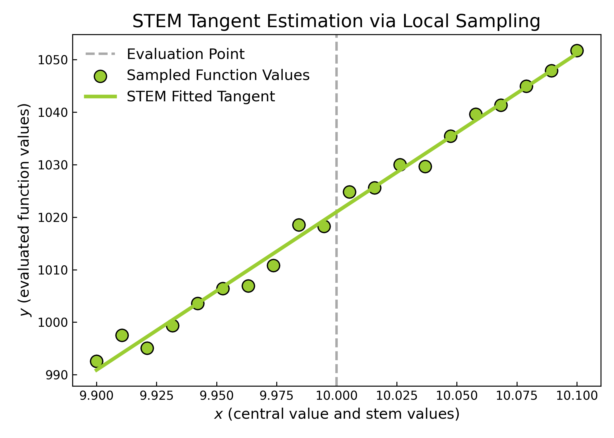
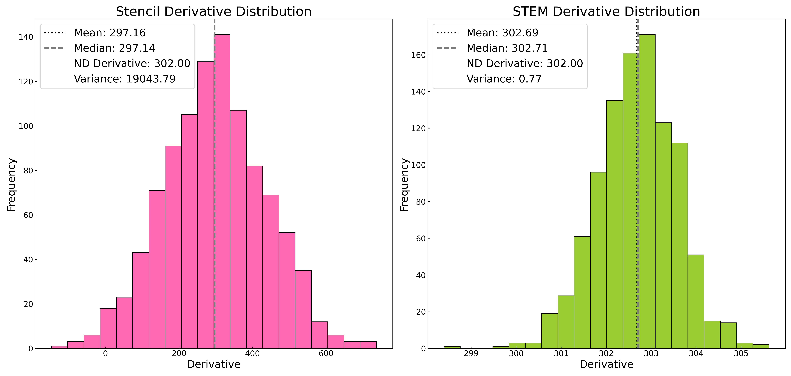
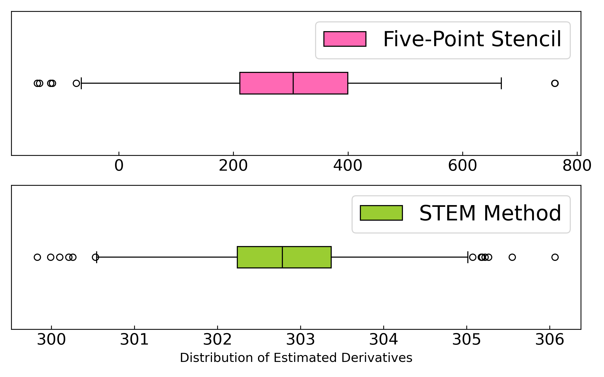

# derivkit

> A robust Python toolkit for estimating derivatives using the STEM method and the five-point stencil method.
> Designed for stability, speed, and noise resilience—ideal for cosmology and other scientific computing tasks.

---

## Table of Contents

- [Overview and Motivation](#overview-and-motivation)
- [How the STEM Method Works](#how-the-stem-method-works)
- [Why Use This Package](#why-use-this-package)
- [Notebooks and Examples](#notebooks-and-examples)
- [Benchmark: STEM vs. Stencil](#benchmark-stem-vs-stencil)
- [Installation](#installation)
- [Usage](#usage)
- [Directory Structure](#directory-structure)
- [License](#license)
- [Contributors and Thanks](#contributors-and-thanks)

---

## Overview and Motivation

`derivkit` provides robust numerical derivative estimates using the **STEM method**, an adaptive algorithm
that improves derivative stability—particularly important when functions are noisy or irregular.

This is critical in applications such as **Fisher matrix forecasts** and **numerical likelihoods**, 
where unstable or poorly estimated derivatives can corrupt cosmological parameter constraints.

Alongside the STEM method, we provide the classic **five-point stencil method** for benchmarking,
and tools for visualization and noise testing.

---

## How the STEM Method Works

The **STEM (Stability-Enhanced Method)** derivative algorithm operates as follows:

1. **Function Sampling**: It evaluates the target function at symmetric offsets around a central point.
2. **Iterative Clipping**: It fits a polynomial through the sampled points and removes the points that most degrade the fit.
3. **Polynomial Fit**: The slope of the final polynomial is taken as the estimated derivative.
4. **Fallback Strategy**: If STEM fails (e.g., too noisy), it can revert to a safe finite-difference estimate.

This approach is based on [Camera et al. (2016)](https://arxiv.org/abs/1606.03451) 
and improves numerical stability especially under **noisy** or **non-smooth** function evaluations.

> STEM is particularly useful when you expect large noise fluctuations or non-analytic behavior in
> your input function (e.g., from simulations or observational data).

---

## Why Use This Package

- **Noise-resistant**: Performs better on non-analytic or noisy functions
- **Configurable**: Tune thresholds, fitting order, or fallback methods  
- **Modular**: Easy to extend or plug into inference pipelines  
- **Fast**: Benchmarked for performance—STEM remains efficient even when adaptive  
- **Compatible**: Works with scalar or vector-valued functions; supports reshaping

---

## Notebooks and Examples

We provide several Jupyter notebooks under `notebooks/`:

- `derivkit_example_usage.ipynb`: A quick-start guide showing STEM use on 1D and 2D functions.
- `stem_vs_stencil_comparison.ipynb`: Visual comparison of STEM and stencil on noisy inputs.
- `benchmark_stem_stencil.ipynb`: Benchmarks timing performance and includes a plot.
- `logs/`: Contains debug logs from various function tests using STEM.
- `plots/`: Contains output visualizations from histogram and boxplot comparisons.

### Sample Figures

**Visual demo of STEM behavior**:  


**Histogram comparison with `numdifftools` baseline**:  


**Boxplot of distribution spread**:  


---

## Benchmark: STEM vs. Stencil

We test the time cost of each method on functions with increasing evaluation time:


> 🔎 **Conclusion**: STEM adds negligible overhead even on slow functions (up to 2s per call). 
> Its increased stability makes it the better choice when derivative quality matters.

---

## Installation

Clone and install locally:

```bash
git clone https://github.com/nikosarcevic/derivkit.git
cd derivkit
pip install -e .
```


## Dependencies
```bash
pip install numpy matplotlib seaborn numdifftools scipy
```


## Usage
```python
import numpy as np
from derivkit.hybrid import HybridDerivativeCalculator


# Define a simple function
def my_function(x):
    return np.array([np.sin(x)])

# Initialize the calculator
calc = HybridDerivativeCalculator(
    function=my_function,
    central_value=np.pi / 4,
    derivative_order=1
)

# Compute the derivatives
stem_result = calc.stem_method()
stencil_result = calc.five_point_stencil_method()

print("STEM method derivative:", stem_result)
print("Five-point stencil derivative:", stencil_result)

```

### Note on Vector Outputs

If your function returns a 2D array (e.g., shape `[n_x, n_y]`, such as a 2D data vector of angular power spectra in cosmology),  
make sure to **flatten it** before passing it into the calculator.

The internal logic assumes each function evaluation returns a **1D array**, so you'll want to wrap your function like this:

```python
def wrapped_func(x):
    return original_func(x).flatten()
# After computing the derivative, you can reshape it back for interpretability:
flat_deriv = calc.stem_method()
reshaped = flat_deriv.reshape(n_x, n_y)
```

## Directory Structure

```
derivkit/
├── derivkit/
│ ├── init.py
│ ├── hybrid.py # STEM and stencil logic
│ ├── plotter.py # Plotting and comparison visuals
├── docs/
│ ├── source/ # Sphinx source files (index.rst, conf.py, etc.)
│ ├── build/ # Generated HTML files
│ ├── Makefile
│ └── make.bat
├── notebooks/
│ ├── derivkit_example_usage.ipynb
│ ├── stem_vs_stencil_comparison.ipynb
│ ├── benchmark_stem_stencil.ipynb
│ ├── plots/ # Histogram, boxplot, timing figures
│ └── logs/ # Debug logs from STEM method
├── setup.py
├── pyproject.toml
├── LICENSE
└── README.md

```

## License
This project is licensed under the MIT License. See the [LICENSE](LICENSE) file for details.

## Contributors and Thanks

This project was inspired by the work of [Camera et al. (2016)](https://arxiv.org/abs/1606.03451) 
and is developed and maintained by **Niko Šarčević** and **Matthijs van der Wild**.

**Contributors**:  
Bastian Carreres, Matthew Fieckerit, Knut Morå.


