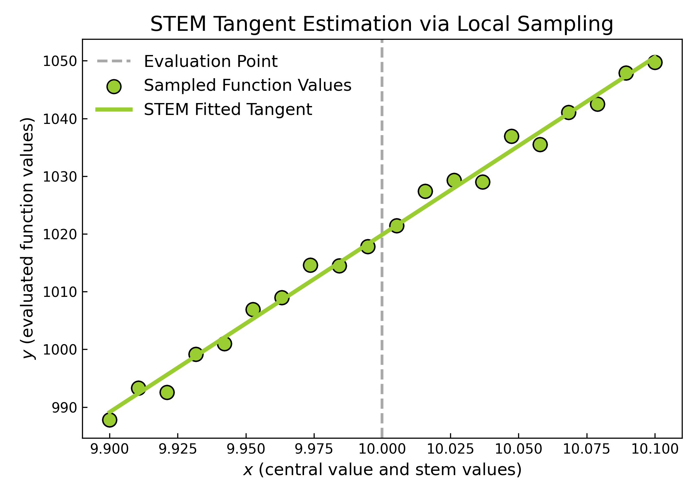
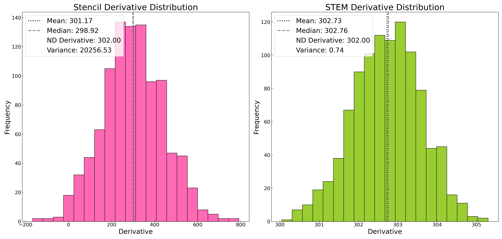
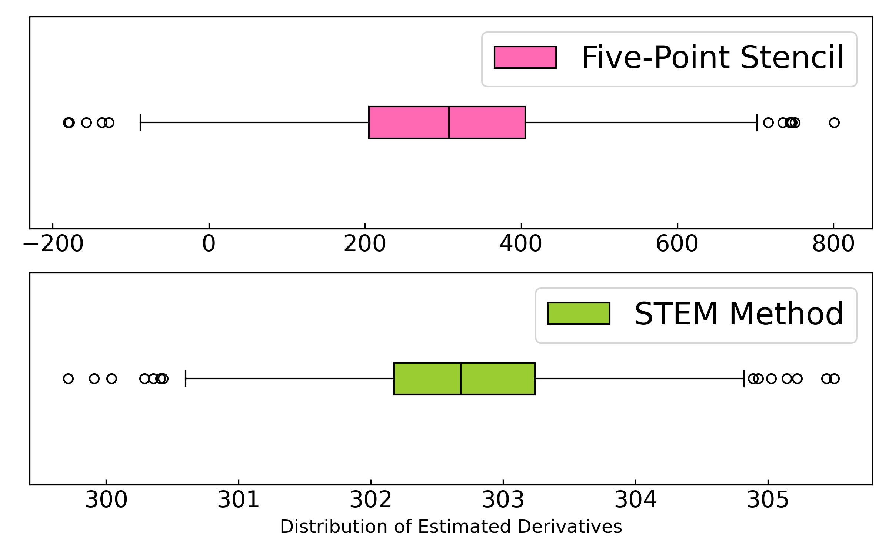

How the STEM Method Works
==========================

The **STEM** algorithm estimates derivatives by iteratively refining a local polynomial fit:

1. **Function Sampling**
   Evaluate the target function at several symmetric points around a central value.

2. **Iterative Clipping**
   Fit a polynomial through the sampled points and iteratively remove those that increase the fit error the most.

3. **Polynomial Fit and Derivative Extraction**
   Once the best-fitting subset is found, the slope of the polynomial gives the estimated derivative.

4. **Fallback Strategy**
   If the fitting process fails (e.g. due to excessive noise or insufficient samples), STEM gracefully falls back to a finite-difference stencil method.

This method is inspired by *Camera et al. (2016)* and is particularly useful when working with noisy simulations, observational data, or functions with non-analytic structure.

.. warning::

   STEM assumes the function is sampled symmetrically and that the noise is not pathological. It is not suitable for chaotic or discontinuous functions.

Visual Examples
---------------

**1. STEM Method Demo**

**2. Histogram Comparison with Numdifftools Baseline**

**3. Boxplot of Distribution Spread**

---

